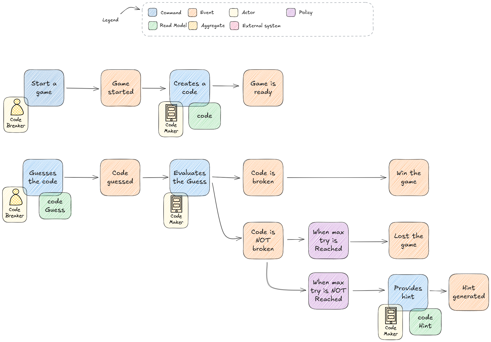

# NgMastermind

This project is an implementation of the Mastermind game in Angular.

## Todo

- [ ] Start a new game
  - [x] Generate a new game id
  - [x] Generate a new code
- [ ] Propose a guess
- [ ] Check the guess
  - [ ] if the guess is correct, the game is win
  - [ ] if the guess is incorrect, the game displays a hint
- [ ] There is a maximum number 10 tries

## Development server

Run `ng serve` for a dev server. Navigate to `http://localhost:4200/`. The application will automatically reload if you change any of the source files.

## Code environments

### test

Runs the unit tests with Vitest with command `npm run test`.
Component tests are run with Angular Testing Library.
